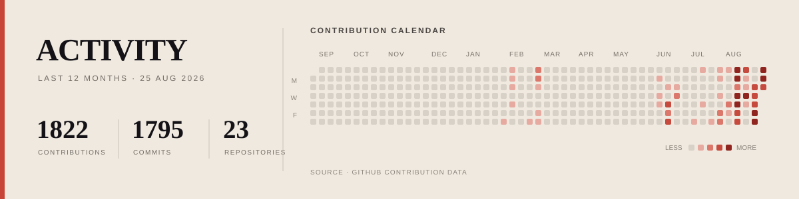

**Independent builder turning ambitious ideas into complete, working products**

I work from the problem outward, taking responsibility for the product decisions, engineering, design, deployment, and details required to make the result hold together

### Selected work

<table>
<tr>
<td width="50%" valign="top">

#### [ARCANUM](https://github.com/bunnyyxtan/ARCANUM)

Policy-governed smart wallets for AI agents with contract-enforced controls and public operator surfaces

`Arc Testnet` `Solidity` `TypeScript`

[Live system](https://thearcanum.in)

</td>
<td width="50%" valign="top">

#### [MIDNAT](https://github.com/bunnyyxtan/MIDNAT)

24/7 synthetic-equity perpetuals with deterministic risk controls and transparent onchain clearing

`X Layer Testnet` `Foundry` `Solidity`

[Website](https://midnat.xyz) · [Trading terminal](https://app.midnat.xyz)

</td>
</tr>
<tr>
<td width="50%" valign="top">

#### [THE-VAJRA](https://github.com/bunnyyxtan/THE-VAJRA)

Recipient-authenticated payments using EIP-712 and onchain WebAuthn passkeys for atomic settlement

`Monad Mainnet` `Sourcify verified` `98 tests`

Zero custody, no backend

[Live app](https://thevajra.xyz)

</td>
<td width="50%" valign="top">

#### [FairMate](https://github.com/bunnyyxtan/fairmate)

Human vs AI chess with TeeTLS-verified inference and a real-stakes challenge pot

`0G Aristotle Mainnet` `0G Router` `TypeScript`

[Play FairMate](https://fairmate-cyan.vercel.app)

</td>
</tr>
<tr>
<td width="50%" valign="top">

#### [DAWN Sunrays Checker](https://github.com/bunnyyxtan/Dawn-Sunrays-Checker)

Zero-dependency public leaderboard adopted by the DAWN team as its official checker

`Static web app` `Zero dependencies`

[Open the checker](https://dawnrank.xyz)

</td>
<td width="50%" valign="top">

#### [technocore-onboard](https://github.com/bunnyyxtan/technocore-onboard)

One command from no identity to a locally generated did:key and an offline-verifiable signed receipt

`MIT` `Ed25519` `Zero dependencies`

[Open technocore.chat](https://technocore.chat)

</td>
</tr>
</table>

### How I build

- Start with the problem, not a preferred stack
- Own the path from early concept to working release
- Build deeply where the product requires it and simplify everywhere else
- Treat reliability, documentation, and polish as part of the product

### Stack

  
  
  
  
  
  
  
  

 

