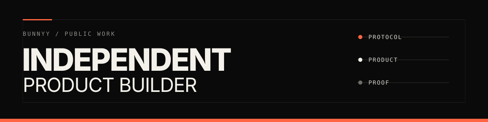

<picture>
  <source media="(prefers-color-scheme: dark)" srcset="assets/profile-header.svg">
  <source media="(prefers-color-scheme: light)" srcset="assets/profile-header.svg">
  
</picture>

 

**I take difficult systems from protocol design to a working product**

Contracts, backends, interfaces, deployment, documentation, and evidence belong to the same job

My work sits where software has to handle money, identity, agents, or verifiable decisions without hand-waving the failure modes

### Selected systems

<table>
<tr>
<td width="50%" valign="top">

#### [ARCANUM](https://github.com/bunnyyxtan/ARCANUM)

Policy-governed smart wallets for AI agents with contract-enforced controls and public operator surfaces

`Arc Testnet` `Solidity` `TypeScript`

[Live system](https://thearcanum.in)

Testnet software, currently unaudited

</td>
<td width="50%" valign="top">

#### [MIDNAT](https://github.com/bunnyyxtan/MIDNAT)

24/7 synthetic-equity perpetuals with deterministic risk controls and transparent onchain clearing

`X Layer Testnet` `Foundry` `Solidity`

[Website](https://midnat.xyz) · [Trading terminal](https://app.midnat.xyz)

</td>
</tr>
<tr>
<td width="50%" valign="top">

#### [THE-VAJRA](https://github.com/bunnyyxtan/THE-VAJRA)

Recipient-authenticated payments using EIP-712 and onchain WebAuthn passkeys for atomic settlement

`Monad Mainnet` `Sourcify verified` `98 tests`

Zero custody, no backend

[Live app](https://thevajra.xyz)

</td>
<td width="50%" valign="top">

#### [FairMate](https://github.com/bunnyyxtan/fairmate)

Human vs AI chess with TeeTLS-verified inference and a real-stakes challenge pot

`0G Aristotle Mainnet` `0G Router` `TypeScript`

[Play FairMate](https://fairmate-cyan.vercel.app)

</td>
</tr>
<tr>
<td width="50%" valign="top">

#### [DAWN Sunrays Checker](https://github.com/bunnyyxtan/Dawn-Sunrays-Checker)

Zero-dependency public leaderboard adopted by the DAWN team as its official checker

`Static web app` `Zero dependencies`

[Open the checker](https://dawnrank.xyz)

</td>
<td width="50%" valign="top">

#### [technocore-onboard](https://github.com/bunnyyxtan/technocore-onboard)

One command from no identity to a locally generated did:key and an offline-verifiable signed receipt

`MIT` `Ed25519` `Zero dependencies`

[Open technocore.chat](https://technocore.chat)

</td>
</tr>
</table>

### Build discipline

- Own the full path from system model and contracts to the interface people actually use
- Treat verification, failure modes, and operational evidence as product features
- Keep trust-critical surfaces small, explicit, and auditable
- Ship public proof with the claim whenever the system allows it

### Fully open-source tools

The Technocore toolchain stays MIT licensed and zero dependency

[onboard](https://github.com/bunnyyxtan/technocore-onboard) ·
[verify](https://github.com/bunnyyxtan/technocore-verify) ·
[archive](https://github.com/bunnyyxtan/technocore-archive)

### Contact

**X** / [Bunnyyxtan](https://x.com/Bunnyyxtan)
**Telegram** / [notyour_bunnyy](https://t.me/notyour_bunnyy)
**GitHub** / [bunnyyxtan](https://github.com/bunnyyxtan)